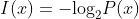

<h1 align="center">🦎Operating System</h1>

## What is OS?

### ☑ What is data?

위 식은 정보의 크기를 구하는 식이다. 
#### 경우의 수가 2가지 일 때 정보량 구하는 법 (x={H, I})
1. I=-log_{2}2^{-1}
2. I=log_{2}2
3. I=log_{2}
4. I=1

따라서 정보의 크기는 1bit이다. (1bit는 0 또는 1로 두가지 경우의 수를 가진다.)

정보는 불확실성을 가지는 상황을 측정해서 수치적으로 표현한 것

#### 정보 처리의 기본
- 정보의 최소 단위 : bit(binary digit)
- 정보의 처리 : 정보의 상태 변환(0 에서 1, 1에서 0)
- 부울 대수(Boolean Algebra) : NOT, AND, OR
- 논리 게이트 : NOT, AND, OR, XOR, NAND, NOR
- 논리 회로 : IC, LSI, VLSI, ULSI, SoC, ......
  - 무어의 법칙, 황의 법칙

#### 정보 처리의 방법
- 덧셈 : 반가산기, 전가산기
- 뺄셈 : 2의 보수 표현법
- 곱셈, 나눗셈 : 덧셈과 뺄셈의 반복
- 실수 연산 : 부동 소수점 표현법(GPU)
- 함수 : GOTO
- 삼각함수, 미분, 적분, 사진, 동영상 ......

#### 컴퓨터 한계
- 범용성
  - NOT, AND, OR 게이트로 모든 계산 가능
  - NAND 게이트만으로 모든 계산 가능
  - 범용 컴퓨터 : 사용할 소프트웨어에 따라 하는게 달라짐
- 계산 가능성
  - Turing-computable : 튜링 머신으로 계산 가능한 것
  - 정지 문제(Halting Problem) : 튜링 머신으로 풀 수 없는 문제

### ☑ Computer ancestors
#### 할아버지 앨런 튜링
- 튜링은 테이프와 헤드를 가지고 튜링 머신(TM)이라는 것을 만들 수 있다 정의
  - 현대로 넘어와 테이프는 메모리, 헤드는 CPU, 튜링은 응용 프로그램이라 부를 수 있음
- 튜링 머신 여러개를 이용하여 UTM이라 불리는 유니버설 튜링 머신 만들 수 있다 정의
  - 유니버설 튜링 머신은 이 레포지터리(깃헙 기준)에서 앞으로 공부할 운영체제가 됨

#### 아버지 폰 노이만
- 내장형 프로그램 방식을 처음 도입
  - 메모리에 프로그램을 저장함 
  - 폰 노이만 아키텍쳐(ISA : Instructino Set Arc)

#### 프로그램이란?
- 하드웨어에게 할 일을 명령하는 명령어들의 집합
- 프로그래밍한 코드가 기계어로 번역되어 사용

#### 운영체제란?
1. 컴퓨터에서 항상 실행되는 프로그램
2. 앱프로그램에 시스템 서비스를 제공
3. 프로세스, 리소스, 입출력 디바이스를 관리

- 컴퓨터 시스템을 소프트웨어 적으로 구현하여 운영하는 시스템
- 하드웨어와 앱 사이에서 인터페이스로 작용
