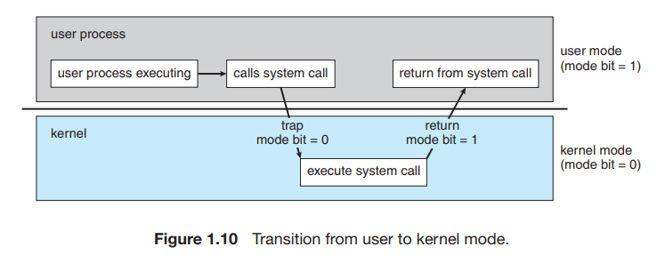
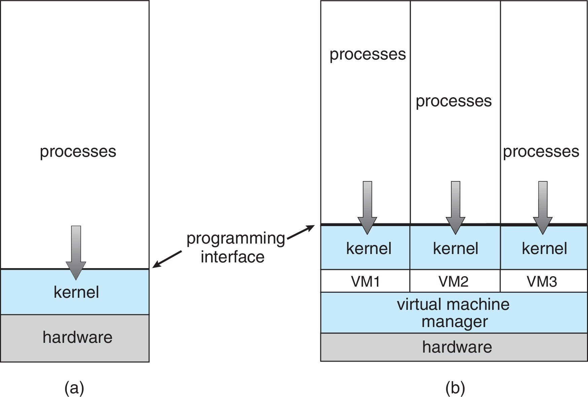
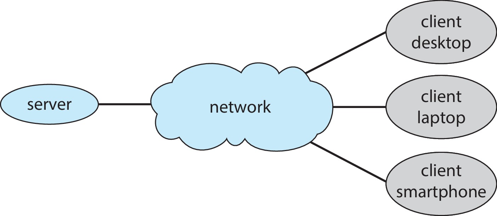
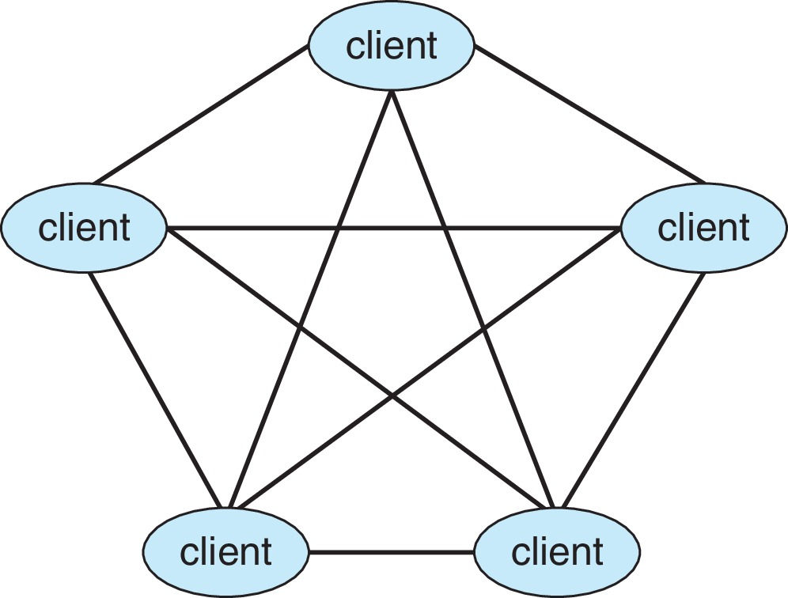
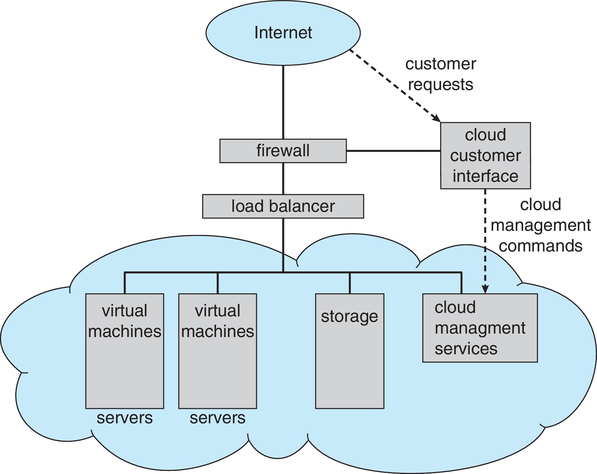

<h1 align="center">🦎Operating System</h1>

## The concept and sturcture of OS

### What Operating System Do

#### 운영체제의 정의(전 강의 짚고가기)

#### 컴퓨터 시스템을 구성하는 요소
- 하드웨어
- 운영체제
- 어플리케이션 프로그램
- 사용자

여러명의 유저가 프로그램을 통해 운영체제에서 하드웨어에 명령을 내리고 실행 & 사용

이 중 운영체제란
- 컴퓨터 하드웨어를 관리하는 소프트웨어
- 어플리케이션과 유저, 하드웨어간 매개역할

#### 운영체제의 정의
- 보편적으로 인정되는 정의가 없음
- 일반적으로 말하는 정의
  - 항상 컴퓨터에서 돌아가는 하나의 프로그램
  - 보통 **커널**이라고 부름
- 커널
  - 시스템 프로그램과 어플리케이션 프로그램의 인터페이스를 제공
  - OS 핵심

#### 전통적인 컴퓨터 시스템의 구성
- 하나 이상의 CPU
- 공용 버스를 통해 연결된 여러개의 디바이스 컨트롤러

Device controller | disk controller | USB controller | graphics adapter
--- | --- |--- | ---
bus | storage | Input device(mouse, keyboard) | output device(monitor)

#### 부트스트랩 프로그램
- 컴퓨터가 전원이 들어왔을 때, 처음으로 돌아가는 프로그램
- 컴퓨터가 켜지면 ROM에 저장된 Bootstrap load가 실행
- 부팅 : 부트 로더가 하드디스크에 있는 OS(특히 kernel)를 뒤져서 메인 메모리로 가져오는 과정
- 정리 : 부트스트랩은 운영체제를 찾아 메모리에 올려 실행시킴

#### 인터럽트
- cpu가 프로그램을 실행중일 때, 입출력 하드웨어에서 예외가 생겨서 처리해야 할 경우 cpu에게 알려 처리할 수 있도록 하는 것
  - 요약 : 입력장치가 컨트롤러를 통해서 입력된 값을 cpu에 넘겨주는 것

- 입력 A와 B가 있었다고 가정
1. 일단 입출력 디바이스가 idle(프로세스가 실행 중이지 않은 상태)상태
2. 입력 디바이스에서 A를 입력 받아 입력 신호 전송
3. cpu에서 입력을 처리
4. 입력 디바이스에서 B를 입력 받아 입력 신호 전송
5. cpu에서 입력을 처리

#### 폰 노이만 아키텍쳐(fetche, excute)
- 명령 주기(Instruction excution cycle)
  - 정의된 명령어 집합에 있는 명령어들을 메모리로 패치
  - cpu가 메모리에 명령어들을 하나씩 패치, 실행
  - 명령들을 IR을 사용하여 저장
- 명령 디코딩
  - 피연산자를 메모리에 가져옴
  - 내부 레지스터에 저장
- 피연산자에 명령 실행 후
  - 명령어 실행
  - 결과를 다시 메모리에 저장

#### 저장 시스템의 계층 구조
- 용량에 따른 계층
- 접근시간에 따른 계층

저장시스템 | 설명
--- | ---
register | cpu 내장
cache | 램보다 작지만 빠름
main memory | RAM
solid-state disk(SSD) | 메모리 형태의 하드 디스크
hard disk | 자기장을 이용한 하드 디스크
optical disk | 많은 용량
magnetic tapes | 더 많은 용량

#### 입출력 구조
- thread of execution를 가진 cpu가 캐시 메모리를 통해 램에 엑세스
- I/O device가 인터럽트를 걸면 해당 cpu는 데이터와 I/O request를 반환
  - 위 인터럽트 설명에서 나온 과정 반복 + cpu와 램 사이의 값 전달
- DMA : CPU 연산이 필요하지 않을 때, 디바이스와 메모리 혹은 디바이스끼리 데이터를 주고 받는 것
- 운영체제에서 개발은 디바이스가 추가, 업그레이드되면 디바이스 컨트롤러를 개발하는 것이 주 역할

#### 컴퓨터 시스템 컴포넌트의 정의
- CPU : 명령을 실행하는 하드웨어
- Processor : 하나 이상의 CPU를 포함하는 물리적인 칩
- Core : CPU의 핵심, 이진수 연산
- Multicore : 동일 CPU에 여러 코어를 포함
- Multiprocessor : 여러 프로세서 포함

#### 대칭형 다중처리(SMP)
- 가장 일반적인 **다중** 프로세서 시스템
  - 각 피어 CPU 프로세서가 모든 작업을 수행
- 비대칭형 다중처리(중요하지 않음)
  - 각 프로세서에 특정 작업 할당

< CPU가 여러개 >

#### 다중 코어 프로세서 설계
- 같은 프로세서 칩 안에 여러개의 다른 코어가 존재

< 하나의 CPU, 여러 코어 >

#### 멀티 프로그래밍(중요)
- 한 번에 하나 이상의 프로그램이 실행
- 서로 다른 프로세스가 동시에 메모리에 올려둠
- CPU 활용율을 높일 수 있음

#### 멀티 태스킹(=멀티프로세싱)
- 다중 프로그래밍의 확장
  - CPU가 다른 작업을 자주 전환하는 경우
  - 사용자가 작업 실행 중 각 작업과 상호 작용 가능
- CPU 스케줄링
  - 여러 프로세스를 동시에 실행 할 수 있는 경우
  - 시스템이 다음 실행할 프로세스를 선택

#### 분리된 두 작동 모드 : 
- 유저 모드(어플리케이션)/ 커널 모드(운영체제)
- 잘못된 (바이러스, 이상한) 프로그램이 실행 될 수 있음
  - 다른 프로그램에 방해되는 역할을 막음(운영체제가 할 일)

유저 프로세서 실행 -> 운영체제 요청 -(커널 모드)-> 시스템 처리 -(유저모드)-> 요청 반환

OS를 제외한 소프트웨어는 직접 하드웨어에 접근이 어려움

#### 가상화*
- 다음을 가능하게 하는 기술
  - 하나의 컴퓨터를 추상화
  - 다른 실행 환경으로 전환
- VMM(Virtual Machine Manager)
  - VMware, XEN, WSL

VMM을 활용한 가상화를 통해 하나의 하드웨어에 여러 OS(Kernel)을 설치할 수 있다.
(디스크나 메모리를 가상화하여 사용하기 때문에 디스크가 꼬여 마운트 문제가 생길 일이 없다.)

### 컴퓨팅 환경
- 다양한 컴퓨팅 환경의 운영체제
  - Traditional Computing (가장 기본적인 컴퓨터)
  - Mobile Computing (안드로이드, 아이폰)
  - Client-Server Computing (웹)
  - Peer-to-Peer(P2P) Computing (비트 토렌트, 블록체인(비트 코인))
  - Cloud Computing (AWS, Azure, GCP)
  - Real-Time Embedded Systems(RTOS)

Client-Server system은 서버를 다수의 사용자가 네트워크를 통해 1:1 통신을 하는 구조

Peer to Peer System은 다른것의 개입 없이 사용자들끼리 N:N 통신을 하는 구조

